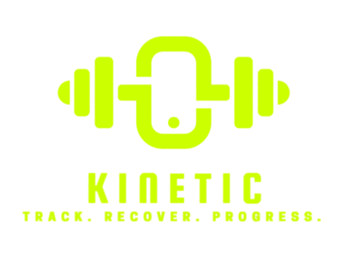

# KINETIC — Track. Recover. Progress.



KINETIC is a personal fitness tracking web app built for athletes and gym-goers who want a clean, fast, and data-driven way to log their training, monitor recovery, and track long-term progress — without the bloat of mainstream fitness apps.

No social feeds. No ads. No fluff. Just your data.

---

## Overview

Most fitness apps are either too simple (just a timer) or too overwhelming (social features, paid plans, gamification). KINETIC sits in the middle — it gives you a structured, powerful logging system that feels like upgrading from a gym notebook to a real tool.

The app is designed around a daily workflow:
1. **Log your daily metrics** — weight, calories, protein, sleep
2. **Log your workout** — exercises, sets, reps, weight, failures
3. **Log your recovery** — fatigue, sleep quality, soreness by muscle group
4. **Review your history** — see trends, past workouts, and recovery patterns

---

## Tech Stack

| Layer | Technology |
|---|---|
| Frontend | React 18 + TypeScript |
| Build Tool | Vite |
| Styling | Tailwind CSS (dark mode, custom theme) |
| State Management | Zustand (with localStorage persistence) |
| Data Fetching | TanStack Query (React Query v5) |
| Backend / Database | Supabase (PostgreSQL + Auth + RLS) |
| Authentication | Supabase Auth (Google OAuth + email) |
| Exercise Library | API Ninjas Exercises API (one-time bulk import) |
| Deployment | Netlify (CI/CD via GitHub) |

### Architecture

KINETIC follows a strict **service layer architecture** — Supabase is never called directly inside React components. All database logic lives in service files under `src/features/*/services/`. This keeps the UI clean and makes it straightforward to swap the backend in the future.

```
src/
├── features/
│   ├── auth/          # Supabase Auth (login, session)
│   ├── dailyLog/      # Daily metrics (weight, sleep, calories)
│   ├── workout/       # Workout sessions, exercises, sets
│   ├── exercises/     # Exercise library (API + custom)
│   ├── feedback/      # Body feedback and muscle soreness
│   └── history/       # Historical data queries
├── pages/             # Route-level page components
├── layouts/           # Main app layout (sidebar + topbar)
├── components/ui/     # Reusable UI primitives
├── lib/supabase/      # Supabase client + types
└── store/             # Zustand global store
```

### Database Schema

- `daily_logs` — one row per user per day (weight, calories, protein, sleep, notes)
- `workouts` — each workout session (date, type, duration)
- `exercises` — master exercise library (name, muscle group, difficulty, type, instructions)
- `workout_exercises` — exercises added to a specific workout (ordered)
- `sets` — individual sets (reps, weight, to_failure flag)
- `body_feedback` — daily recovery log (fatigue, sleep quality, pain flag)
- `muscle_soreness` — per-muscle soreness tied to a feedback entry

Row Level Security (RLS) is enabled on all tables — users can only access their own data.

---

## Features

### Dashboard
- Live date and time display
- **Daily Log** — inline editable fields for weight, calories, protein, sleep, and notes; auto-saves on blur
- **Last Workout** card — shows the most recent completed workout: type, duration, exercises, sets, and total volume
- **Start Workout** button — begins a new session
- **Repeat Last Workout** button — pre-fills the last workout's exercises and set data so you can get started immediately

### Workout
- Start a workout and assign a workout type (Push, Pull, Legs, Full Body, or any custom label you define)
- Add exercises from the library to your session
- Log sets with reps, weight, and a failure toggle
- Each set is saved to the database on blur — no manual save button
- Duplicate race conditions prevented (no double inserts)
- Auto-focuses the weight input when a new set is added
- Live session timer showing start time and elapsed duration
- Finish workout saves everything and clears the session
- Workout state is persisted to localStorage — refresh mid-session and it recovers

### Exercises
- **Library tab** — browse 1,000+ exercises imported from API Ninjas, searchable by name with muscle group filter chips; shows difficulty, type, and full instructions
- **Custom tab** — create your own exercises with name, muscle group, and equipment; auto-focuses the name input for fast entry
- Select one or multiple exercises to add to your active workout

### History
- **Daily Logs tab** — table of all daily log entries, sorted latest first; includes workout type and duration for each day so you can see training vs rest days at a glance
- **Exercise History tab** — per-exercise history showing all logged sets across sessions
- **Recovery tab** — all body feedback entries with fatigue, sleep quality, and muscle soreness by date

### Feedback (Recovery)
- Log daily body feedback: fatigue level (1–10), sleep quality (1–10), pain flag
- Select sore muscle groups with severity level
- Upserts correctly — logging feedback twice on the same day updates the existing entry, no duplicates
- Soreness entries replace old ones for the same day

### Settings
- **Account** — shows logged-in email, logout button
- **Exercise Library** — shows library size, last import date, API key status; Import or Refresh the exercise library with a progress bar
- **About** — app version and info

---

## Getting Started (Local Dev)

### Prerequisites
- Node.js 18+
- A [Supabase](https://supabase.com) project
- An [API Ninjas](https://api-ninjas.com) account (free tier is fine for the one-time import)

### Setup

```bash
git clone https://github.com/anishsinhaa/kinetic.git
cd kinetic
npm install
```

Copy the example env file and fill in your values:

```bash
cp .env.example .env
```

```env
VITE_SUPABASE_URL=your_supabase_project_url
VITE_SUPABASE_ANON_KEY=your_supabase_anon_key
VITE_EXERCISES_API_KEY=your_api_ninjas_key
```

Run the SQL schema in your Supabase SQL Editor:

```
supabase/schema.sql
supabase/auth_rls_migration.sql
supabase/add_exercise_library.sql
```

Then start the dev server:

```bash
npm run dev
```

---

## Deployment

The app is deployed on **Netlify** with automatic CI/CD via GitHub. Every push to `main` triggers a new production deployment.

Build config is defined in `netlify.toml`:
- Build command: `npm run build`
- Publish directory: `dist`
- SPA redirect: all routes fall back to `index.html`

Environment variables (`VITE_SUPABASE_URL`, `VITE_SUPABASE_ANON_KEY`, `VITE_EXERCISES_API_KEY`) are set in the Netlify dashboard and are never committed to the repository.

---

## Roadmap

### Coming Soon (Web)
- Progressive overload tracking and volume charts
- Body weight trend graph
- Personal records (PRs) per exercise
- Weekly summary view
- Dark/light theme toggle

### Mobile App
A native mobile app for KINETIC is planned. The goal is full feature parity with the web app — log workouts, track recovery, and review history from your phone. The same Supabase backend will power both platforms, so your data syncs seamlessly between web and mobile.

---

## Design

- **Color:** Neon green `#CCFF00` on near-black `#0B0B0B`
- **Font:** Inter (300–900 weights)
- **Theme:** Dark-only, high contrast, minimal chrome
- **Philosophy:** Fast inputs, no modals, inline editing everywhere

---

## License

Personal project. Not licensed for redistribution.
